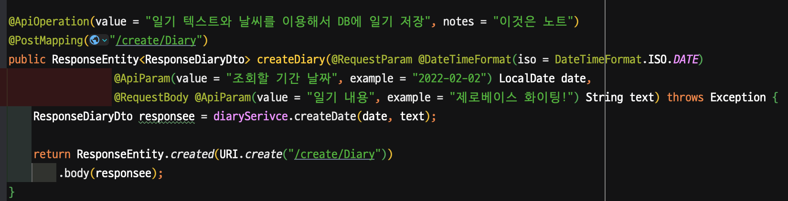
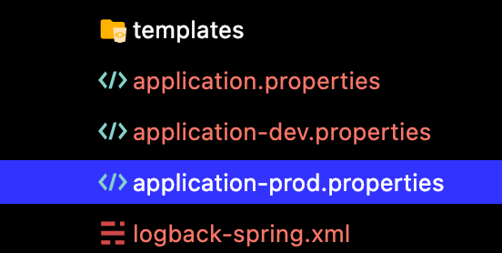
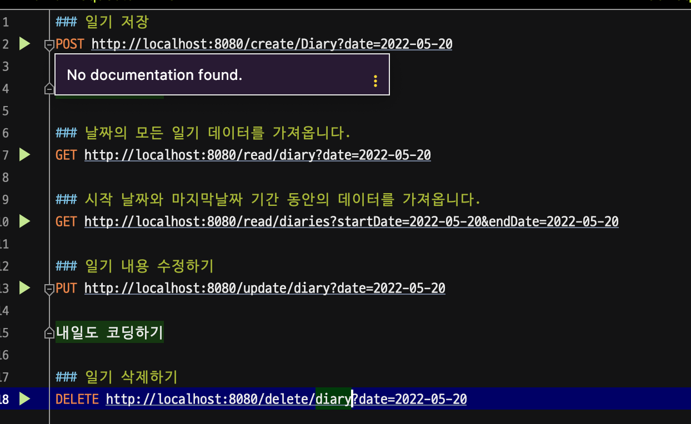

# 🌞 날씨 프로젝트

- API를 만들어보는 것을 해봅니다.

## 기능

1. [x] 일기 등록 API
2. [x] 일기 조회 API
3. [x] 일기 수정 API
4. [x] 일기 삭제 API
5. [x] swagger로 문서 만들기
6. [x] Exceptionhandler로 예외 처리
7. [x] logback 사용자 정의
8. [x] 스케줄 기능 넣기

## 강사님과 다르게 한 점..

1. Entity에서 setter를 빼기

entity에서는 setter로 값이 수정되면 저장이 됩니다.  
그렇기 때문에 생성자를 이용하여 만드는 것이 안전하다고 생각하였습니다.

2. ResponseEntity로 응답값을 반환하고, Entity보다는 Dto로 반환을 합니다.

3. profile 에 따라 h2, mysql를 사용하도록 하였습니다.

4. .http 인텔리제이에서 제공하는 API 요청으로 테스트합니다.

